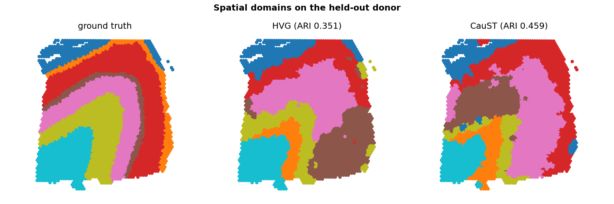

# Five-minute demo

A guided tour of CauST that runs end-to-end from a fresh clone. Total compute
time is under two minutes on a laptop (plus a one-time ~60 MB data download for
the real-tissue section); the only prerequisite is
[uv](https://docs.astral.sh/uv/getting-started/installation/).

Every command below is copy-pasteable from the repository root.

## 1. Setup — one command

```bash
git clone https://github.com/land-saas/CauSt.git && cd CauSt
uv sync
```

`uv sync` reads the committed `uv.lock`, fetches the interpreter pinned in
`.python-version` if it is missing, and builds `.venv` with the package and all
dev tooling — the same locked environment CI and the Docker image use. There is
nothing to activate; `uv run` handles that from here on.

## 2. The idea, live

```bash
uv run scripts/demo.py
```

Three synthetic donors share eight `CAUSAL_*` genes that define the spatial
domains in every donor. Each donor also has private `DONORNOISE_*` genes with
**higher variance** but no cross-donor signal — exactly the trap that
variance-based gene selection falls into.

CauST silences each gene in-silico on a frozen spatial model, measures the
embedding shift per donor, and keeps genes whose effect is large **and stable
across donors**. Watch the ranking:

```text
Top-12 genes by invariance score:
  CAUSAL_7         0.9758  <-- causal
  CAUSAL_1         0.5160  <-- causal
  ...
  NOISE_13         0.1539

Causal genes recovered in top-8: 8/8
ARI on causal gene set (donor 0): 1.000
```

All eight causal genes rank above every noise gene, and clustering on just
those eight recovers the ground-truth domains perfectly.

## 3. The headline benchmark — CauST vs. HVG on a held-out donor

```bash
uv run scripts/benchmark.py --figures docs/figures
```

Genes are selected on donors 1–2 only; donor 3 is never seen during selection.
That held-out donor is the robustness claim:

```text
Causal genes recovered in the top-8:
  HVG    1/8
  CauST  8/8

Held-out donor 3 (never used for gene selection, 5 restarts):
  ARI  all genes  (68 genes)  1.000 +/- 0.000
  ARI  HVG        ( 8 genes)  0.537 +/- 0.133
  ARI  CauST      ( 8 genes)  1.000 +/- 0.000
```

CauST matches the all-genes ceiling with **8× fewer genes**, while the
variance baseline at the same budget loses ~0.46 ARI — and is unstable across
clustering seeds (±0.133) where CauST is exactly stable (±0.000).

The command also regenerates the two figures:


Panels A and B are the crux: the invariance score isolates the causal genes,
while variance ranks the donor-specific noise genes highest.


## 4. The same claim on real tissue

The synthetic trap is engineered, so the honest question is whether the story
survives contact with real data:

```bash
uv run caust run -c configs/experiment/dlpfc_holdout.yaml --figures
```

The first run fetches five 10x Visium slices of human dorsolateral prefrontal
cortex from the spatialLIBD DLPFC dataset (~60 MB, cached under `data/DLPFC/`
and verified against SHA-256 checksums pinned in the package). Three donors,
manual cortical-layer annotations (L1–L6 + white matter). Genes are selected
using the two training donors only; the third donor is evaluated exactly once,
and the tuning knobs (lambda, gene budget) were chosen by sweeping on the
training donors alone.

```text
known layer markers kept in the top-25 (of 8 in pool):
  HVG    2/8
  CauST  1/8

held-out donor:
  ARI  all_genes  (2000 genes)  0.378 +/- 0.026
  ARI  hvg        (  25 genes)  0.351 +/- 0.034
  ARI  caust      (  25 genes)  0.459 +/- 0.069
```

Twenty-five CauST-selected genes beat the variance baseline at the same budget
by +0.11 ARI on a donor the selection never saw — and beat the full 2,000-gene
candidate pool. The selected set is biologically legible, too: it includes MBP
(myelin / white matter), CLU and SPARCL1 (astrocytic genes with laminar
expression), and NRGN (neurogranin), alongside metabolic and ribosomal genes
whose laminar gradients happen to be donor-stable. It is *not* dominated by the
textbook marker panel (the marker count above is reported, not hidden) — CauST
optimizes for cross-donor predictive stability, not for matching a curated
list.



The run takes about ten seconds once the data is cached. That speed is not
free: scoring a knockout for each of 2,000 genes across five slices is cheap
because the reference backbone computes each knockout as a rank-1 update to the
base embedding instead of a fresh forward pass.

## 5. Every number is reproducible

Each run writes a content-addressed directory under `results/` with the
resolved config, the metrics, and a provenance manifest (git commit, package
versions, platform, seed, BLAS thread counts, artifact checksums).

```bash
uv run caust verify results/synthetic_holdout-*/
uv run caust verify results/dlpfc_holdout-*/
```

```text
REPRODUCED: results/synthetic_holdout-0759a2e2cbad matches a fresh run of its recorded config
REPRODUCED: results/dlpfc_holdout-bdf4a4109c47 matches a fresh run of its recorded config
```

And determinism is not an accident — two separate processes produce
byte-identical artifacts (CI enforces this on every push):

```bash
make determinism
```

```text
OK: artifacts are byte-identical across processes
```

See [REPRODUCIBILITY.md](https://github.com/land-saas/CauSt/blob/main/REPRODUCIBILITY.md)
for what is controlled and how.

## 6. Quality gates

```bash
make check
```

Runs ruff, mypy, and the 98-test suite with a 90% coverage gate (currently
~94%), through the same locked environment. CI additionally proves the built
sdist/wheel install and test cleanly on Python 3.9–3.12.

## What you just saw

- **A causal claim, tested honestly** — gene selection on training donors,
  evaluation on a held-out donor, against the standard HVG baseline; first on
  a synthetic cohort built to embarrass variance-based selection, then on real
  human cortex where nothing was engineered to cooperate.
- **One lockfile everywhere** — `uv.lock` backs local dev, CI, and Docker;
  `uv sync` rebuilds the exact environment on any machine.
- **Provenance by default** — every result carries the config, seed, and
  environment that produced it, and `caust verify` re-earns it on demand.
