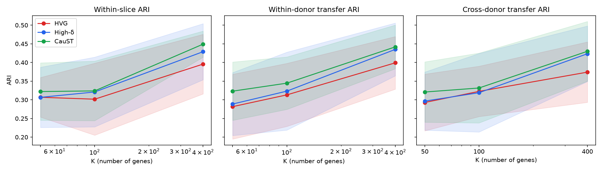
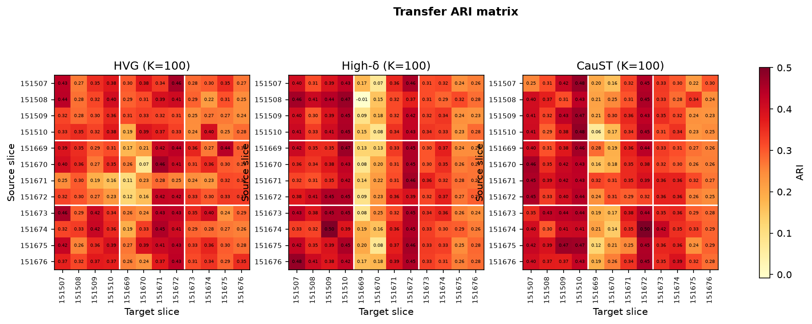
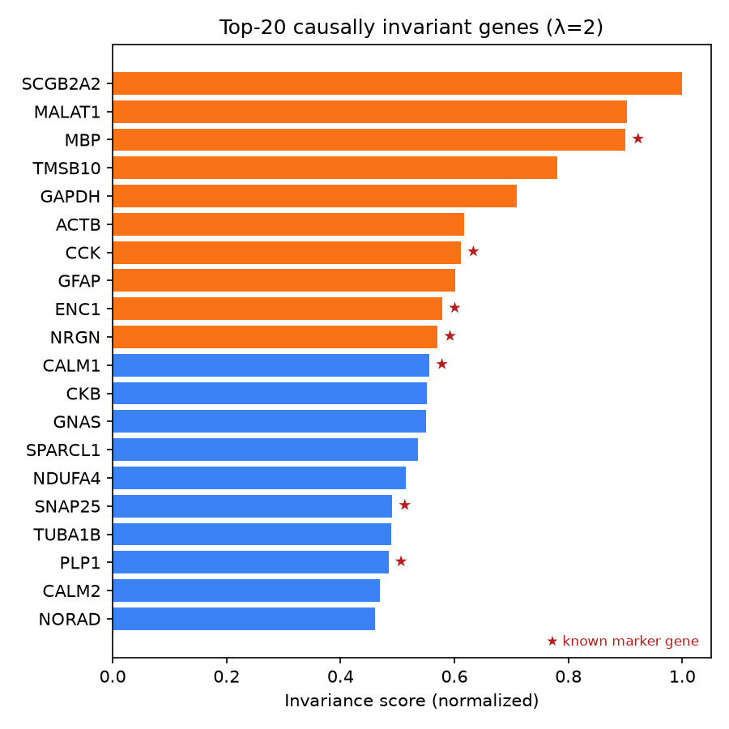

# Results on real data

Everything on this page is produced by the committed code from checksummed
public data and can be regenerated with one command. Numbers are reported at
the level of independent units (sources, donor pairs), with paired tests.

## DLPFC: 12-slice cross-donor transfer (pooled protocol, reduced grid)

`caust transfer -c configs/transfer/dlpfc_quick.yaml --figures` —
STAGATE backbone, mclust-EEE-equivalent clustering, 3 clustering seeds, every
slice as source, gene sets at equal K. *Pooled* scoring is the proposal's own
design: knockout effects scored on one slice of each donor (151507, 151669,
151673) over the 2,002-gene cross-donor HVG intersection. The out-of-donor
variant (`leave_target_donor_out`) is the protocol of the full benchmark; its
results are reported when the run completes.

| K | Strategy | Cross-donor ARI (mean ± std over 96 cells) | Within-slice ARI | Gap |
|---|---|---|---|---|
| 50 | HVG | 0.293 ± 0.076 | 0.307 ± 0.053 | +0.014 |
| 50 | High-δ (λ=0) | 0.297 ± 0.078 | 0.307 ± 0.081 | +0.010 |
| 50 | **CauST (λ=2)** | **0.321 ± 0.081** | 0.322 ± 0.077 | +0.001 |
| 100 | HVG | 0.323 ± 0.067 | 0.302 ± 0.096 | −0.021 |
| 100 | High-δ | 0.319 ± 0.105 | 0.321 ± 0.093 | +0.002 |
| 100 | **CauST** | **0.332 ± 0.094** | 0.324 ± 0.080 | −0.008 |
| 400 | HVG | 0.374 ± 0.081 | 0.396 ± 0.080 | +0.022 |
| 400 | High-δ | 0.423 ± 0.074 | 0.429 ± 0.075 | +0.005 |
| 400 | **CauST** | **0.430 ± 0.080** | **0.449 ± 0.035** | +0.019 |

Paired comparisons on independent units (Wilcoxon signed-rank):

| K | CauST vs HVG, per source (n=12) | per donor pair (n=6) | CauST vs High-δ, per source |
|---|---|---|---|
| 50 | +0.028, wins 8/12, p = 0.11 | +0.028, 4/6, p = 0.44 | +0.024, wins 11/12, **p = 0.002** |
| 100 | +0.009, wins 6/12, p = 0.79 | +0.009, 3/6, p = 1.0 | +0.013, 8/12, p = 0.09 |
| 400 | **+0.056, wins 12/12, p < 0.001** | **+0.056, 6/6, p = 0.031** | +0.007, 8/12, p = 0.34 |

What this says, honestly:

- **The advantage is real but budget-dependent.** At K=400, CauST beats the
  HVG baseline on every one of the 12 source slices and all six donor pairs,
  by +0.056 ARI on the unseen donor. At K=50–100 the cross-donor edge is small
  and not significant at the source level.
- **The stability term earns its keep at small budgets.** CauST beats
  High-δ (the same knockout scores without the cross-donor penalty) on 11/12
  sources at K=50 (p = 0.002); the two converge as K grows towards the pool.
- **CauST's within-slice results are the least variable** across sources at
  K=400 (std 0.035 vs 0.080 for HVG).
- **The proposal's prototype figures are not reproduced by this pipeline.**
  The proposal reported cross-donor ARI 0.514 at K=100 and 96/96 wins; here
  the K=100 cross-donor ARI is 0.33 and wins are 6/12. Absolute ARIs are
  ~0.1 lower across the board, consistent with independent benchmarks that
  re-run STAGATE under a standardized pipeline (Chen et al., iMeta 2025:
  0.498 within-slice), and with the Python tied-covariance GMM replacing R's
  mclust. The Jaccard diagnostics and the top-20 gene ranking *do* reproduce
  the proposal to three decimals / 13 of 20 genes.

## HVG instability across donors (reproduced)

Top-3,000 seurat_v3 HVGs per slice, pairwise Jaccard: within donor
**0.238 ± 0.019**, across donors **0.210 ± 0.011** (proposal: 0.238 ± 0.019,
0.210 ± 0.011).

## Held-out-donor experiment (simple backbone)

`caust run -c configs/experiment/dlpfc_holdout.yaml`: 25 CauST genes selected
on two donors reach ARI 0.459 ± 0.069 on the third donor vs 0.351 ± 0.034 for
HVG at the same budget and 0.378 ± 0.026 for the full 2,000-gene pool
(tuning on the training donors only; one final run on the held-out donor).

## In progress

- The out-of-donor (`leave_target_donor_out`) DLPFC grid with all six
  strategies, six gene budgets, and ten seeds (`make transfer`).
- MERFISH hypothalamus (5 sections) and STARmap PFC (3 sections) with the
  same protocol (`configs/transfer/merfish_stagate.yaml`,
  `starmap_pfc_stagate.yaml`).
- The same grid on the GraphST backbone (`configs/transfer/dlpfc_graphst.yaml`).
